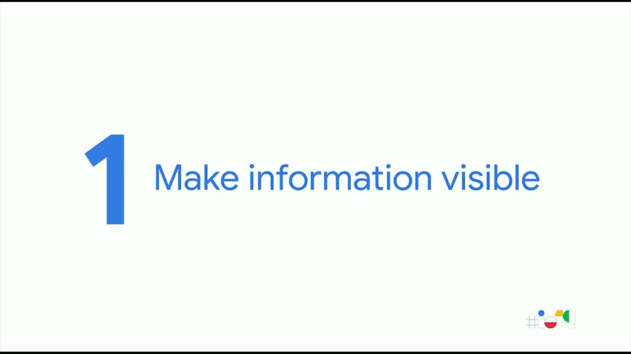
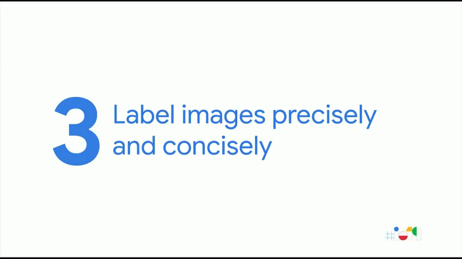
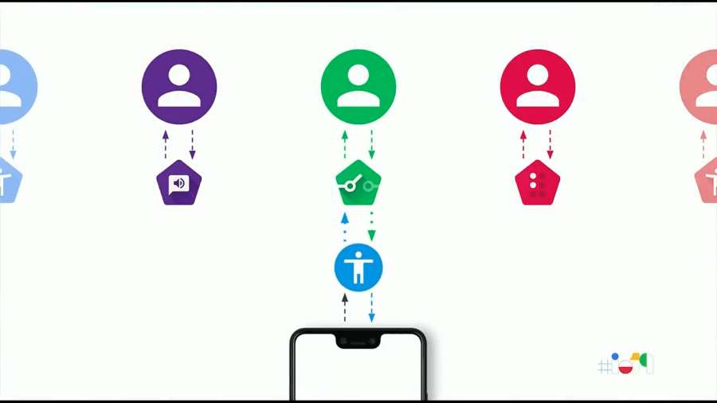
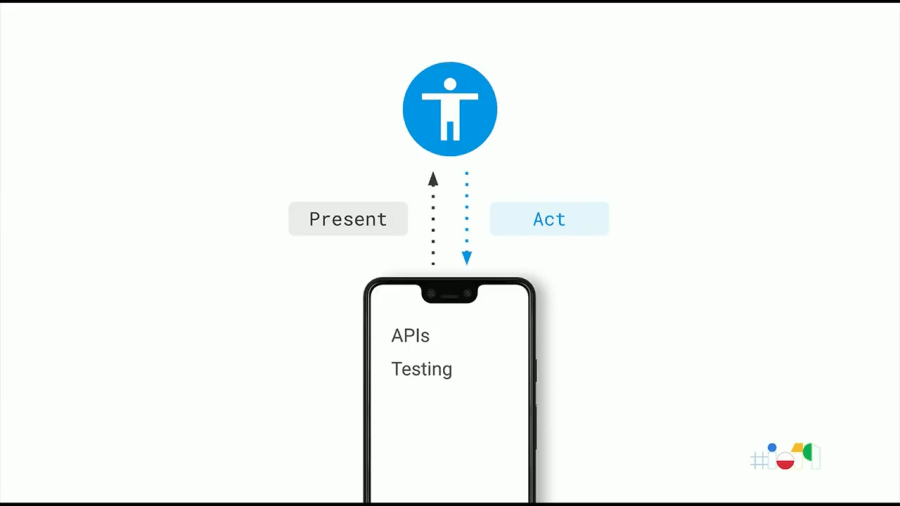
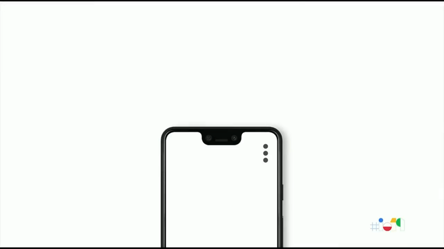
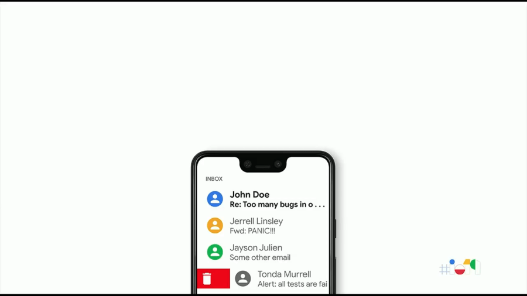
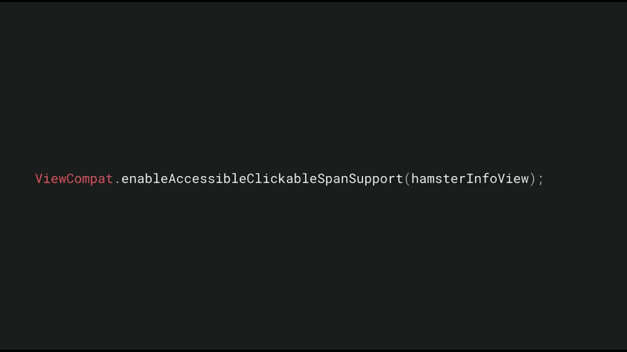
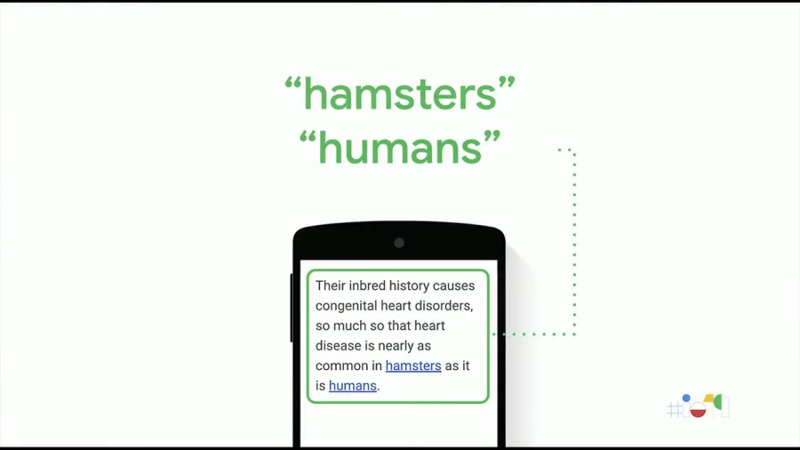
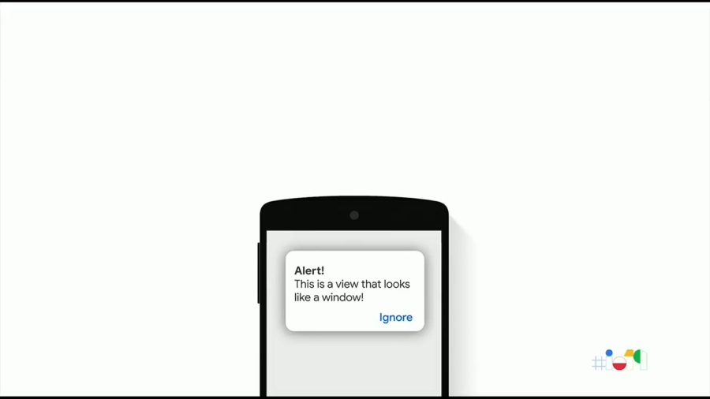
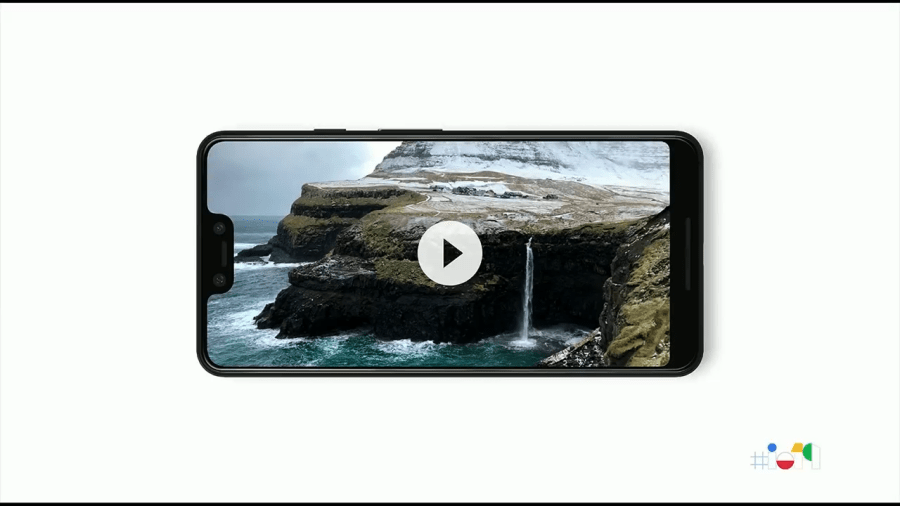

<iframe width="560" height="315" src="https://www.youtube.com/embed/bTodlNvQGfY" frameborder="0" allow="accelerometer; autoplay; encrypted-media; gyroscope; picture-in-picture" allowfullscreen></iframe>
<!--more-->

Android Accessibility 개발은 매우 복잡하다. Accessibility 조차 Android의 일부이다.

→ 구글 팀이 할일은 복잡성을 다루지않도록 하는 것

세션의 목표

- 아이디어
- 접근성에 대한 전반적인 아이디어
- 경험을 단순화하기 위한 새로운 API
- Test를 위한 일부 Tools

## 일상적인 작업에 적용할 수 있는 세 가지

### 1. 정보를 공개

대부분이 시각 장애인을 위한 접근성에 대해서 먼저 시작한다.

#### 크기

- 시력이 약하다
- 나이가 들어서 작은 글씨를 읽기 어려운 것

추가 도구 및 손쉬운 사용없이 정보를 잘 보이게하는 것은 어렵다.

#### 색상

색맹인 사람들에게는 전달하려는 정보가 누락

### 2. 간단하고 큰 컨트롤 선호

UI를 보고 내용을 이해할 수 있을때 UI를 사용할 수 있을까? 

이 때 컨트롤의 변화로 큰 차이를 만들 수 있다.

작은 공간에 많은 기능을 추가하면 누군가는 어려움을 겪게된다. (ex, 손가락이 커서 UX 경험이 나쁜 경우)

→ 중요한 정보는 크고 이해하기 쉽게 컨트롤할 수 있도록 해야한다.

### 3. 이미지를 정확하고 간결하게 라벨링

화면을 볼 수 없는 사용자를 돕기 위해서는 많이 생각해야한다. 이미지 사용시, 전혀 볼 수 없는 사람에게도 효과가 있는지 체크해야한다.

- 간단한 해결 : 이미지에 레이블 지정
- 이유 : 텍스트로 정보가 전달되는지 확인이 필요하다. ScreenReader 사용자 경험에서는 Graphic이 얼마나 좋은지에 대해서는 관심 밖이다. 
- 가능한 정확하게, 방법을 설명하려면 동사인 단어만 사용

사용자가 앱과 상호 작용하는 방식에서 본질적으로 두가지가 있다

- 사용자에게 정보 제공
- UI에서 어떤 행동을 함

앱 개발 단계 (선결제를 위한 사람들을 타겟팅)

- 일반적인 사람
- 시각 장애 : 서로 다른 수준의 장애가 있으며, 특정 유형의 물건을 볼 수 없기도 하다
- 운동 장애 : 다양한 종류가 존재
- 청각 장애

이런 장애가 조합적인 사람들도 있다.

전세계에는 10억명의 장애를 가진 사람이 있지만, 10억개의 사례를 기준으로 하지 않아도 된다. 이런 생태계에서 `접근성 서비스` 를 통해 많은 사례에 맞게 확장할 수 있도록 지원한다. 접근성 서비스는 Android Platform에 대한 플러그인이며, 사용자 대신 UI에 대한 정보를 얻거나 액션을 취할 수 있다.

특정 사용자에 맞게 정보를 제공하는 방법을 제시한다.

- 오디오
- 점자
- 스위치

동작 방식은 Android Framework를 통해서 처리한다. 

API를 사용하여 정보를 제시하고 사용자가 Action을 하도록 하는 것이다. 그런 다음 테스트 도구를 사용하여 실제로 동작하는지 확인한다.

------

## Accessibility API

### 1. ContentDescription

접근성 서비스와 통신하는 방법은 `접근성 API`를 사용하는 것이다. 대부분은 뷰 계층을 통해서 유추 가능하다. 그러나, 위와 같은 옵션 버튼은 Android Framework는 화면의 위치 및 클릭가능한 정보 등을 `View.java` 를 통해 유추할 수 있다.

화면을 볼수 없는 `TalkBack` 사용자는 이 항목에 손가락을 대면 아무것도 얻지 못한다. TalkBack이 해당 상황에서 무엇을 말해야하는지 모르기 때문이다. 그것은 Description Text가 없기 때문이다.

Content Description API를 통해서 설명을 추가할 수 있다. Localized 된 문자열을 전달하면 된다. 누군가는 문자열을 들어야하므로 현지화와 간결한 설명이 필요하다.

추가 옵션 버튼이라는 것을 알게 되었으며, 원하던 상호작용을 이어나갈 수 있다.

### 2. AccessibilityAction

다른 예로는, 이메일 UI에서 스와이프로 이메일을 삭제/읽음을 표시할 수 있다. 스와이프하면 해당 이메일은 삭제된다. 그러나 모든 사용자가 탭/스와이프를 할 수 있는 것은 아니다.

- TalkBack 사용자는 다른 제스처를 통해 UI 동작
- 스위치 사용자는 단일 스위치를 통해 UI 동작

`접근성 서비스`를 통해서 각 케이스에서 할 수 있는 작업을 알 수 있다.

ContentDescription과 유사하게 `접근성 API`를 사용하면 된다.

> [ViewCompat#addAccessibilityAction](https://developer.android.com/reference/androidx/core/view/ViewCompat#addAccessibilityAction(android.view.View,%20java.lang.CharSequence,%20androidx.core.view.accessibility.AccessibilityViewCommand))

View, 지역화된 문자열, 사용자 요청시 수행할 Lambda 를 전달하여 정의한다.

`ViewCompat#addAccessibilityAction` API를 사용함으로 스위치 사용자가 Select/Remove 작업을 모두 수행할 수 있다.

> AndroidX API이므로 `API 21 이상`에서 동작한다.

### 3. EnableAccessibleClickableSpanSupport

Android O 이전에는 Accessibility Frameworks가 텍스트 링크 혹은 ClickableSpans 사용시 URL이 아닌 범위에 대한 처리를 할 수 없었다. TalkBack 사용자는 화면에 링크가 있다는 메시지가 표시되지 않는 문제가 발생했다. 

해당 문제를 해결하기 위해 AndroidX에 API가 추가되었다.

> [ViewCompat#enableAccessibleClickableSpanSupport](https://developer.android.com/reference/androidx/core/view/ViewCompat#enableAccessibleClickableSpanSupport(android.view.View))
>
> `API 19 이상`에서 동작한다.

> 정상적으로 적용된 경우의 화면

### 4. AccessibilityPaneTitle

Dialog가 아니라 ViewGroup 과 텍스트와 버튼의 조합으로 구현하는 경우, 상황에 따라 시각적으로 표현하는 정보가 결정되므로 TalkBack과 같은 접근성 서비스에 문제가 발생한다.

이 경우, 해결방법은 ViewGroup에 접근성을 제공하는 것이다.

> [ViewCompat#setAccessibilityPaneTitle]([https://developer.android.com/reference/androidx/core/view/ViewCompat#setAccessibilityPaneTitle(android.view.View,%20java.lang.CharSequence)](https://developer.android.com/reference/androidx/core/view/ViewCompat#setAccessibilityPaneTitle(android.view.View, java.lang.CharSequence))
>
> `API 19 이상`에서 동작한다.

이제 TalkBack을 통해서 올바르게 음성으로 알려준다.

### 5. Timeout

비디오 플레이어에서 재생 버튼 등이 일정 시간이 지나면 사라지는 컨트롤이 있는 것은 일반적이다. 대부분 콘텐츠를 원하기때문에 유용한 기능이다.

그러나, 컨트롤과 상호작용하는데 시간이 걸리는 접근성 사용자를 위해서 재생 버튼을 화면에 다시 표시하는 방법을 찾아야한다. Timeout으로 사라지기 전에 상호 작용하는 방법을 찾아야한다. 

필요한 것은 상황에 따라 이상적으로 필요한 Timeout 시간을 조정하는 방법이다. 

사용자가 반응 할 시간을 줄 수 있도록 최소한이 시간 동안 컨트롤을 화면에 유지해야합니다. 

1. AccessibilityManager에 대한 참조를 취득한다
2. getRecommendedTimeoutMillis API를 호출한다. 사용자에게 필요한 UI 변경에 대한 Timeout 시간이 반환된다. 

> 적용된 사례 : [SnackBar#Duration](https://github.com/material-components/material-components-android/blob/master/lib/java/com/google/android/material/snackbar/Snackbar.java#L307)

- FLAG_CONTENT_CONTROLS
- FLAG_CONTENT_ICONS
- FLAG_CONTENT_TEXT

------

## Anti-patterns

화면에서 볼 수 없는 음성 안내 지원 사용자를 위해 특별히 제작한다는 가정을 해보자.

Now, let's just say you're trying to build very specifically for the TalkBack user, the user that can't see on screen.
You try to determine what the experience is going to be when a new email appears.
And you're trying to figure out how to express this change, and you figure the best thing you can do is by making an announcement.
Every time a new email appears, announce the email.
Well, this is a bad idea.
And if you catch yourself using the accessibility event TYPE_ANNOUNCEMENT, you're probably conforming to this anti-pattern.
You see, changes in the UI are expressed very differently, depending on the accessibility service and the user's preferences.
Services don't need fine tuning of accessibility UI from the application.
They need a generic representation of the UI that they themselves can manipulate for the users that they understand so well.
So what do you do in this situation? This is what you do.
That's right.

화면에서 볼 수없는 음성 안내 지원 사용자를 위해 특별히 제작하려고한다고 가정 해 보겠습니다.
새 이메일이 나타날 때 어떤 경험이 될지 결정하려고합니다.
그리고 당신은이 변화를 표현하는 방법을 찾으려고 노력하고 있으며, 당신이 할 수있는 가장 좋은 일은 발표를하는 것입니다.
새 이메일이 나타날 때마다 이메일을 알리십시오.
글쎄, 이것은 나쁜 생각입니다.
접근성 이벤트 TYPE_ANNOUNCEMENT를 사용하여 자신을 발견하면 아마도이 안티 패턴을 따르는 것입니다.
UI의 변경 사항은 내게 필요한 옵션 서비스 및 사용자 기본 설정에 따라 매우 다르게 표현됩니다.
서비스는 응용 프로그램에서 접근성 UI를 미세 조정할 필요가 없습니다.
이해하기 쉬운 사용자를 위해 스스로 조작 할 수있는 일반적인 UI 표현이 필요합니다.
이 상황에서 무엇을하십니까? 이것이 당신이하는 일입니다.
맞습니다.

You don't do anything.
And you can do this by using the widgets we provide to you in our frameworks, such as AndroidX and Material.
These widgets come with accessibility built in out of the box, which significantly reduce the amount of work you as an app developer have to do.
So you can really focus on the very particular value that your application provides to the world.
But if you really must write your own custom widgets, if you really must do it yourself, make sure you're communicating the exact semantics of the changes in your UI by using the correct accessibility events and populating it correctly.
Remember, in this situation, you're not communicating directly with the user.
You're communicating with the accessibility service.
So something similar that people like to do is manage accessibility focus themselves.
And again, this is a bad idea.
Accessibility focus has to be determined by the accessibility service.
And just like announcements, this creates an inconsistency in experience.
And actually, that's one of the biggest issues that accessibility users face, inconsistency across applications and over time.

당신은 아무것도하지 않습니다.
AndroidX 및 Material과 같은 프레임 워크에서 제공하는 위젯을 사용하여이를 수행 할 수 있습니다.
이 위젯에는 기본 제공되는 접근성이 내장되어있어 앱 개발자가해야 할 작업량을 크게 줄일 수 있습니다.
따라서 애플리케이션이 세계에 제공하는 매우 특별한 가치에 집중할 수 있습니다.
그러나 실제로 사용자 정의 위젯을 작성해야하는 경우 직접 작성해야하는 경우 올바른 내게 필요한 옵션 이벤트를 사용하고 올바르게 채워서 UI 변경 사항의 정확한 의미를 전달하고 있는지 확인하십시오.
이 상황에서는 사용자와 직접 통신하지 않습니다.
접근성 서비스와 통신하고 있습니다.
따라서 사람들이 좋아하는 것과 비슷한 것은 접근성 포커스 자체를 관리하는 것입니다.
그리고 다시, 이것은 나쁜 생각입니다.
내게 필요한 옵션은 내게 필요한 옵션 서비스에 의해 결정되어야합니다.
발표와 마찬가지로 경험에 일관성이 없습니다.
실제로, 이는 접근성 사용자가 직면 한 가장 큰 문제 중 하나이며, 응용 프로그램간에 시간이 지남에 따라 일관성이 없습니다.

You see, there are a lot of applications.
And if you as an app developer decide to break with the paradigms of accessibility interaction from the rest of the system, you're making your users' lives frustrating, because now that accessibility user, every time they open your application, they've got to throw out all of their expectations in terms of how their interaction works.
And they've got to relearn this whole new UI at a very fundamental level.
The best thing that you can do for your accessibility user is to maintain consistency over time and with a system.
OK, now that you know how to fix your issues, Isha's going to talk about how to find them and how to make sure you fix them.
ISHA BOBRA: Thanks, Qasid.
Hello, everyone.

알다시피, 많은 응용 프로그램이 있습니다.
그리고 앱 개발자가 나머지 시스템과의 접근성 상호 작용 패러다임을 극복하기로 결정하면 사용자의 삶이 좌절됩니다. 이제 내게 필요한 접근성 사용자는 응용 프로그램을 열 때마다 그들의 상호 작용이 어떻게 작동하는지에 대한 모든 기대를 버립니다.
그리고이 완전히 새로운 UI를 매우 근본적인 수준으로 다시 배워야합니다.
내게 필요한 옵션 사용자를 위해 할 수있는 최선의 방법은 시간이 지남에 따라 시스템과 일관성을 유지하는 것입니다.
이제 문제를 해결하는 방법을 알게되었으므로 Isha는 문제를 찾는 방법과 문제를 해결하는 방법에 대해 이야기 할 것입니다.
ISHA BOBRA : 감사합니다. Qasid.
여러분 안녕하세요.

So now that we know what we are building for and how to build it, the next obvious question is, how do I know what I built is correct?
Things like, is my text visible to most of the users? Or is my button large enough, or even if my button is labeled or not? Wouldn't it be nice if someone could check that for us? 
Well, there are several approaches in which you can answer this question and make the testing task easy.
On a high level, there are three approaches that you can leverage as a developer to ensure you're creating an accessible experience for most of your users.
The first is automated tests.
This technique requires some coding changes and is very good to detect accessibility issues at the very early developmental phases.
You can run these tests alongside your existing UI unit or integration test as part of resubmit or continuous integration solution.

이제 우리가 무엇을 만들고 있는지 그리고 그것을 어떻게 구축하는지 알았으므로, 다음으로 분명한 질문은, 내가 만든 것이 올바른지 어떻게 알 수 있습니까?
내 텍스트가 대부분의 사용자에게 표시됩니까? 또는 내 버튼이 충분히 크거나 내 버튼에 라벨이 붙어 있더라도 말입니까? 누군가 우리를 위해 그것을 확인할 수 있다면 좋지 않을까요?
이 질문에 대답하고 테스트 작업을 쉽게 수행 할 수있는 몇 가지 방법이 있습니다.
높은 수준에서 개발자로서 활용하여 대부분의 사용자가 액세스 할 수있는 환경을 만들 수있는 세 가지 방법이 있습니다.
첫 번째는 자동화 된 테스트입니다.
이 기술은 약간의 코딩 변경이 필요하며 초기 개발 단계에서 접근성 문제를 감지하는 데 매우 좋습니다.
다시 제출 또는 지속적인 통합 솔루션의 일부로 기존 UI 단위 또는 통합 테스트와 함께 이러한 테스트를 실행할 수 있습니다.

The next tool we're going to look at is the accessibility testing tools.
These tools do not require any technical knowledge and can be run by QA teams and release managers to perform a sanity check before your app is released out in public.
And the third is a manual testing, which, by experience, we have realized is one of the most effective ways to ensure you're creating an end to end experience for users with disabilities in real world scenarios.
Let's take a deep dive into the three techniques.
Let's first talk about integrating accessibility into your existing testing code.
Most of the Android Accessibility testing tools are backed by the Android Accessibility Testing Framework.
It is a Java library that is written on a rule-based system to evaluate Android UI constructs for accessibility issues at runtime.
Remember, it's open source.
So if you wish to make contributions and add checks for accessibility, please reach out to us on GitHub.

다음으로 살펴볼 도구는 내게 필요한 옵션 테스트 도구입니다.
이 도구는 기술 지식이 필요하지 않으며 QA 팀과 릴리스 관리자가 앱을 공개적으로 공개하기 전에 상태 확인을 수행하기 위해 실행할 수 있습니다.
세 번째는 경험에 따라 실제 시나리오에서 장애가있는 사용자에게 엔드 투 엔드 경험을 제공 할 수있는 가장 효과적인 방법 중 하나 인 수동 테스트입니다.
세 가지 기술에 대해 자세히 알아 보겠습니다.
먼저 접근성을 기존 테스트 코드에 통합하는 방법에 대해 이야기하겠습니다.
대부분의 Android 접근성 테스트 도구는 Android 접근성 테스트 프레임 워크에서 지원합니다.
런타임에 접근성 문제에 대한 Android UI 구성을 평가하기 위해 규칙 기반 시스템에서 작성된 Java 라이브러리입니다.
오픈 소스라는 것을 기억하십시오.
당신이 기여를하고 접근성에 대한 점검을 추가하고 싶다면 GitHub에서 우리에게 연락하십시오.

So what does this framework test for? It tests for missing labels, which actually prevents users of screen readers from understanding the content within your app.
It looks for small touch targets, which can prevent users with dexterity issues to interact with your app.
It also looks for low contrast text and images, which impacts the legibility of your app, and it looks for other implementation-specific issues, which can actually prevent your app from sending the proper semantics to the Android Accessibility Framework.
So that was about the framework, and we understood what the framework tests for.
The question is, how do I use this framework? So we've made it really easy to integrate this Accessibility Testing Framework into the existing testing frameworks like Espresso and Robolectric.
These are provided as an optional competent, and you can use our existing test code to run these checks.
As you interact with the view in your tests, these accessibility checks run automatically before proceeding.
So if you're interacting with a button in your test, we look for the button and potentially the UI around the button to look for accessibility issues.

이 프레임 워크는 무엇을 테스트합니까? 레이블이 없는지 테스트하여 실제로 화면 판독기 사용자가 앱 내의 콘텐츠를 이해하지 못하게합니다.
작은 터치 대상을 찾아 손재주 문제가있는 사용자가 앱과 상호 작용하지 못하게 할 수 있습니다.
또한 명암비가 낮은 텍스트와 이미지를 찾아 앱의 가독성에 영향을 미치고 다른 구현 관련 문제를 찾아 앱이 실제로 의미를 Android 접근성 프레임 워크로 전송하지 못하게 할 수 있습니다.
이것이 프레임 워크에 관한 것이었고 우리는 프레임 워크가 무엇을 테스트하는지 이해했습니다.
문제는이 프레임 워크를 어떻게 사용합니까? 따라서이 접근성 테스트 프레임 워크를 Espresso 및 Robolectric과 같은 기존 테스트 프레임 워크에 쉽게 통합 할 수있게되었습니다.
이 옵션은 선택 사항으로 제공되며 기존 테스트 코드를 사용하여 이러한 검사를 실행할 수 있습니다.
테스트에서 뷰와 상호 작용할 때 이러한 접근성 검사는 계속하기 전에 자동으로 실행됩니다.
따라서 테스트에서 버튼과 상호 작용하는 경우 버튼 및 버튼 주위의 UI를 통해 접근성 문제를 찾습니다.

For Espresso, you can use AccessibilityChecks.
enable to enable the tests.
The result of AccessibilityChecks.
enable is an accessibility validator, which can be used to customize your tests.
For example, you can use .
setRunChecksfroomRootView to increase the coverage of your tests by running them onto the on the entire view hierarchy where a view actions is performed.
You can also call .
setSupressingResultMatcher to whitelist known accessibility issues so that your tests are green as you fix them.
It is required that you use a view action from the view actions class to perform these tests.
In this example, you see the use of click action.
Remember, if you interact with the view directly, you bypass the accessibility checks.
For Robolectric, you use AddAccessibilityChecks annotation to enable the tests.
Tests will be called in the view when you call ShadowView.
clickOn the view you want to test.
And much like Espresso, you can customize your tests using Robolectric's accessibility tools.
So that was all about automated tests, making changes in your code, and figuring out accessibility issues at the very, very early development phases.

Espresso의 경우 접근성 검사를 사용할 수 있습니다.
테스트를 활성화합니다.
접근성 검사 결과.
enable은 테스트를 사용자 정의하는 데 사용할 수있는 접근성 검사기입니다.
예를 들어을 사용할 수 있습니다.
setRunChecksfroomRootView는보기 조치가 수행되는 전체보기 계층 구조에서 테스트를 실행하여 테스트 범위를 증가시킵니다.
전화를 걸 수도 있습니다.
알려진 접근성 문제를 화이트리스트로 설정하여 테스트 할 때 문제가 해결되도록 setSupressingResultMatcher를 설정하십시오.
이러한 테스트를 수행하려면보기 조치 클래스의보기 조치를 사용해야합니다.
이 예에서는 클릭 동작이 사용됩니다.
뷰와 직접 상호 작용하는 경우 접근성 검사를 무시합니다.
Robolectric의 경우 AddAccessibilityChecks 주석을 사용하여 테스트를 활성화합니다.
ShadowView를 호출하면보기에서 테스트가 호출됩니다.
테스트하려는보기를 클릭하십시오.
Espresso와 마찬가지로 Robolectric의 접근성 도구를 사용하여 테스트를 사용자 정의 할 수 있습니다.
초기 단계에서 자동화 된 테스트, 코드 변경, 접근성 문제 파악 등이 전부였습니다.

Next, we're going to look at is using the accessibility testing tools.
These are automated tools and do not require any technical knowledge.
The first we're going to talk about is the Google Play Pre-Launch Report.
It is an automated tool that controls your app on multiple physical devices and looks for accessibility issues so that you can fix them before launching your app.
It looks for issues like crashes, performance, and now even accessibility.
We've made it really easy to get accessibility test results by integrating those directly into its developer console.
These checks run on all APKs released on any Play Store track.
Pre-Launch Report is located within the Google Play Console beneath Release Management.
You can see here's a list of issues that are highlighted by the Pre-Launch Report.
These issues are clustered, characterized, and ranked by severity.
Here's a detailed view of how a report looks like generated by the Pre-Launch Report.
You can see the text with the incorrect contrast ratios highlighted and a suggestion is provided to improve it.
On the left-hand side panel, you can see the occurrences of the similar underlining issues being highlighted.
For each of the accessibility findings identified by the report, there is a Learn More link, which gives you a detailed understanding of the concept and provides suggestions to improve it.

다음으로 접근성 테스트 도구를 사용하겠습니다.
이들은 자동화 된 도구이며 기술 지식이 필요하지 않습니다.
가장 먼저 이야기 할 것은 Google Play 사전 출시 보고서입니다.
이 도구는 여러 물리적 장치에서 앱을 제어하고 접근성 문제를 찾아서 앱을 시작하기 전에 해결할 수있는 자동화 된 도구입니다.
충돌, 성능 및 접근성 같은 문제를 찾습니다.
우리는 개발자 콘솔에 직접 통합하여 접근성 테스트 결과를 쉽게 얻을 수 있도록했습니다.
이 확인은 모든 Play Store 트랙에서 출시 된 모든 APK에서 실행됩니다.
출시 전 보고서는 출시 관리 아래의 Google Play 콘솔에 있습니다.
사전 실행 보고서에서 강조 표시된 문제 목록은 다음과 같습니다.
이러한 문제는 심각도별로 분류되고 특성화되며 순위가 결정됩니다.
다음은 사전 실행 보고서에서 생성 된 보고서의 모양에 대한 자세한보기입니다.
대비 비율이 잘못된 텍스트가 강조 표시되어 개선을위한 제안이 제공됩니다.
왼쪽 패널에서 강조 표시된 유사한 밑줄 문제가 나타나는 것을 볼 수 있습니다.
보고서에 의해 식별 된 각각의 접근성 결과마다 개념에 대한 자세한 이해를 제공하고 개념을 개선하기위한 제안을 제공하는 추가 정보 링크가 있습니다.

Yeah, that was about the Google Play Pre-Launch Report.
Now we're going to move on to the Accessibility Scanner.
It's another app that scans your UI and looks for potential accessibility issues, like missing labels, small touch targets, et cetera.
You do not require any code change to use Accessibility Scanner.
All you need to do is go to the Play Store, download the app, or visit g.
co/accessibilityscanner.
Launching the app will take you through the set-up process.
Here's an app that we've created to highlight some of the known accessibility issues.
You can see a blue floating button on the UI.
This is the button that appears when you switch on Accessibility Scanner.
In order to scan my app, I would simply tap on the blue button while my app's UI is in the foreground.
Here is an example of how a report created by Accessibility Scanner looks like.
You can see the text with incorrect ratios highlighted.
It's not just highlighted, but also a suggestion to improve it is provided.
You can share the reports by scanner via email or Google Drive.
And if you click on the Learn More link, it opens a detailed documentation of the concept and the issue you're looking at.
So that was about the automated tools.
We looked at the automated tests, which required coding changes and are good to detect issues while you're developing.
Next we looked at the automated testing tools, which were the Pre-Launch Report and the Accessibility Scanner.
The third technique we're going to look at is manual testing.
So automation is really helpful, because it helps you detect issues while you're developing, but it's not a complete solution as it comes with certain limitations.
Let's look at them.
If you're depending on your automated tests, and they're based on the test that you've already written for your code, its performance very much depends on the coverage that your test code provides.
Parts of your code that are not tested can have serious accessibility issues.
Secondly, like any other automation, there are always chances of false positives and false negatives.
We strive to reduce false positives as much as we can, but that can result in neglecting some of the legitimate accessibility issues.
And thirdly, there are certain issues that require human judgment and intervention.
For example, our tools can tell you that you're missing a label, but whether or not the label string is making sense to the user is understandable and acceptable is something that only humans can decide.
So manual testing is all about understanding your users and understanding how they're going to interact with your app using assistive technology.

예, Google Play 사전 출시 보고서에 관한 것이 었습니다.
이제 접근성 검사기로 넘어갑니다.
UI를 스캔하고 레이블 누락, 작은 터치 대상 등과 같은 잠재적 접근성 문제를 찾는 또 다른 앱입니다.
내게 필요한 옵션 스캐너를 사용하기 위해 코드를 변경할 필요는 없습니다.
Play 스토어로 이동하거나 앱을 다운로드하거나 g를 방문하기 만하면됩니다.
공동 / 접근성 스캐너.
앱을 시작하면 설정 과정이 진행됩니다.
다음은 알려진 접근성 문제 중 일부를 강조하기 위해 만든 앱입니다.
UI에서 파란색 부동 버튼을 볼 수 있습니다.
내게 필요한 옵션 스캐너를 켤 때 나타나는 버튼입니다.
앱을 스캔하려면 앱 UI가 포 그라운드에있는 동안 파란색 버튼을 누르기 만하면됩니다.
다음은 액세서 빌 러티 스캐너에서 작성된 보고서의 모습에 대한 예입니다.
잘못된 비율로 강조 표시된 텍스트를 볼 수 있습니다.
강조 될뿐만 아니라 개선을위한 제안도 제공됩니다.
이메일 또는 Google 드라이브를 통해 스캐너로 보고서를 공유 할 수 있습니다.
자세히 알아보기 링크를 클릭하면 개념 및보고있는 문제에 대한 자세한 문서가 열립니다.
그것은 자동화 된 도구에 관한 것입니다.
코딩 변경이 필요하고 개발하는 동안 문제를 감지하기에 적합한 자동 테스트를 살펴 보았습니다.
다음으로 Pre-Launch Report와 Accessibility Scanner 인 자동화 된 테스트 도구를 살펴 보았습니다.
우리가 살펴볼 세 번째 기술은 수동 테스트입니다.
따라서 자동화는 개발하는 동안 문제를 감지하는 데 도움이되기 때문에 실제로 유용하지만 특정 제한 사항이 있으므로 완벽한 솔루션은 아닙니다.
그들을 보자.
자동화 된 테스트에 의존하고 이미 코드에 대해 작성한 테스트를 기반으로하는 경우 테스트 코드가 제공하는 적용 범위에 따라 성능이 크게 좌우됩니다.
테스트되지 않은 코드 부분에는 심각한 접근성 문제가있을 수 있습니다.
둘째, 다른 자동화와 마찬가지로 항상 오 탐지 및 오 탐지 가능성이 있습니다.
우리는 가능한 한 오 탐지를 줄이기 위해 노력하지만 합법적 인 접근성 문제를 무시할 수 있습니다.
셋째, 인간의 판단과 개입이 필요한 특정 문제가 있습니다.
예를 들어 Google 도구를 사용하면 라벨이 누락되었음을 알 수 있지만 라벨 문자열이 사용자에게 이해가되는지 이해할 수 있고 수용 가능한지 여부는 사람 만 결정할 수 있습니다.
따라서 수동 테스트는 보조 기술을 사용하여 사용자를 이해하고 앱과 상호 작용하는 방법을 이해하는 것입니다.

One way to achieve this is working directly with these users with accessibility needs and soliciting their feedback.
It can be done formally or informally.
Another way to achieve this is using Android's own Accessibility Services.
So testing your app with TalkBack can actually ensure that you're providing the correct semantics to the Android Accessibility Framework.
And testing your app with Switch Access can ensure that your app is reacting well to the actions initiated by these APIs.
At Google, we've learned that the most successful teams are those who adopt both automated and manual testing in their development process.
If you want to learn more about using Android's Accessibility Services, please visit g.
co/androidaccessibility.
And it can also take you through step-by-step approach to testing with keeping accessibility in mind.
And with that, I will let Phil come up and give some key takeaways.
Thank you.
PHIL WEAVER: Thank you, Isha.
So hopefully you found this information useful.
But as you work on your app, really what we're asking is for you to help us help others use your app and help other accessibility service developers help others use your app.
So we've presented a few APIs here.
We hope you'll use them to share UI with as many people as possible.
If you've played around with accessibility before, you're maybe wondering like why are we not showing you-- we could have gone through the details of accessibility node info and accessibility event.
And our goal is really to try to limit the number of people who ever need to crack that API surface open.
This new API for adding actions I think is really important in that respect, because it used to be, if you were doing something relatively minor, overwriting the touch handler, it was like, OK, you did the small change, and now you've got a crack open this great big API surface and figure out how to modify your accessibility node info.
We have an accessibility action API you needed to add.
You needed to go through and override a method in view.
And a lot of people, they kind of come up against a learning curve, they're like, you know, I'm kind of OK with my touch handler just kind of being like that, and I feel bad about not having it be accessible, but I just don't have the time.
And so we're hoping that these APIs reduce that energy barrier to one line of code that's pretty straightforward.
And so we hope that you'll use them.
Similarly, testing for accessibility, there's all different ways to do it.
We all hope that you'll go out and find a wide range of users and test for accessibility with all of those users.
And I know some of you will.

이를 달성하기위한 한 가지 방법은 접근성 요구 사항이있는 사용자와 직접 작업하고 피드백을 요청하는 것입니다.
공식적으로나 비공식적으로 할 수 있습니다.
이를 달성하는 또 다른 방법은 Android 자체 접근성 서비스를 사용하는 것입니다.
따라서 음성 안내 지원으로 앱을 테스트하면 실제로 Android 접근성 프레임 워크에 올바른 의미를 제공 할 수 있습니다.
또한 Switch Access로 앱을 테스트하면 앱이 이러한 API에 의해 시작된 작업에 잘 반응하고 있는지 확인할 수 있습니다.
Google에서 가장 성공적인 팀은 개발 과정에서 자동화 및 수동 테스트를 모두 채택한 팀이라는 것을 알게되었습니다.
Android 접근성 서비스 사용에 대한 자세한 내용을 보려면 g를 방문하십시오.
co / androidaccessibility.
또한 액세스 가능성을 염두에두고 테스트에 대한 단계별 접근 방식을 안내 할 수도 있습니다.
그걸로 Phil이 일어나서 몇 가지 중요한 조치를 취할 것입니다.
감사합니다.
필 위버 : 감사합니다, 이샤.
이 정보가 도움이 되길 바랍니다.
하지만 앱에서 작업 할 때 실제로 요청하는 것은 다른 사람이 앱을 사용하도록 도와주고 다른 접근성 서비스 개발자가 다른 사람이 앱을 사용하도록 도와주는 것입니다.
여기에 몇 가지 API를 제시했습니다.
UI를 사용하여 가능한 많은 사람들과 UI를 공유하기를 바랍니다.
접근성을 가지고 놀아 본 적이 있다면 왜 우리가 보여주지 않는지 궁금 할 것입니다. 접근성 노드 정보 및 접근성 이벤트에 대한 세부 정보를 살펴볼 수 있습니다.
그리고 우리의 목표는 실제로 API 표면을 열어야하는 사람들의 수를 제한하는 것입니다.
내가 생각하기에 액션을 추가하기위한이 새로운 API는 상대적으로 사소한 일을했을 때 터치 핸들러를 덮어 쓰는 것과 같았 기 때문에 작은 변화를 겪었으므로 이제는 이 큰 API 표면을 열면 접근성 노드 정보를 수정하는 방법을 알아낼 수 있습니다.
추가해야 할 접근성 작업 API가 있습니다.
보기에서 메소드를 검토하고 대체해야했습니다.
많은 사람들이 학습 곡선에 맞서고 있습니다. 마치 터치 핸들러 만 있으면 괜찮아요. 접근 할 수 있지만 시간이 없습니다.
그리고 우리는 이러한 API가 에너지 장벽을 한 줄의 코드로 줄여 줄 것으로 기대하고 있습니다.
그래서 우리는 당신이 그것들을 사용할 수 있기를 바랍니다.
마찬가지로 접근성을 테스트하는 방법에는 여러 가지가 있습니다.
우리는 여러분이 다양한 사용자를 찾아 모든 사용자와의 접근성을 테스트하기를 희망합니다.
그리고 나는 당신의 일부를 알고 있습니다.

But again, we're trying to scale this to the entire ecosystem.
And so that's why we've got these different points where, if we want to just a quick scan, we've got Accessibility Scanner.
We've got something-- after you've uploaded to the Play Store, you can get a quick check for accessibility.
But the more you do, the better the experience will be overall.
And also, as you go through and you do this testing, and you find weird problems, and then you start thinking, I know Qasid said don't do this, don't add announcements, don't try to control focus, but it's just broken.
The only way to make my app better is by just tweaking it a little bit.
You find yourself sort of digging through maybe the TalkBack source code, which is online, to try to figure out what TalkBack is doing and like, OK, how do I sort of give it the right signals that it will do the right thing? Please realize that you probably found a bug, and it's probably our bug.
And we're eventually going to fix that bug, hopefully.
We'll fix it a lot faster if you tell us about it.
So if you find yourself doing engineering-- and realize, if you're doing engineering for accessibility, you're doing a lot more than the average developer.
And we need this ecosystem to work for every developer in order for it to work for every user.
So if you find yourself doing engineering, and you realize no one else in the world is ever going to do this, as Qasid said, you end up building something that's inconsistent with the rest of the platform, even if it's better.
And so if you found something like that, please tell us.
We're monitoring the AOSP issue tracker.
We monitor Stack Overflow.

그러나 우리는 이것을 전체 생태계로 확장하려고 노력하고 있습니다.
따라서 빠른 스캔을 원한다면 접근성 스캐너를 사용하는 여러 가지 점이 있습니다.
Play 스토어에 업로드 한 후 접근성을 빠르게 확인할 수 있습니다.
그러나 더 많이할수록 전반적인 경험이 향상됩니다.
또한 테스트를 수행하고 이상한 문제를 발견하고 생각하기 시작하면 Qasid는 이것을하지 말고 공지 사항을 추가하지 말고 초점을 제어하려고 시도하지 말라고 알고 있습니다. 방금 고장났어
내 앱을 더 좋게 만드는 유일한 방법은 조금만 조정하면됩니다.
온라인 상태 인 TalkBack 소스 코드를 통해 TalkBack이 무엇을하고 있는지 알아 내려고 노력하고 있습니다. 알았어요. 올바른 일을하겠다는 올바른 신호를 어떻게 제공합니까? 버그를 발견했을 가능성이 있으며, 아마도 버그 일 것입니다.
그리고 우리는 결국 그 버그를 고칠 것입니다.
알려 주시면 더 빨리 해결하겠습니다.
엔지니어링을하고 있고 접근성을 위해 엔지니어링을하고 있다면 평범한 개발자보다 훨씬 더 많은 일을하고 있다는 사실을 깨닫게됩니다.
또한 모든 사용자가 작업 할 수 있도록 모든 개발자를 위해이 에코 시스템이 필요합니다.
Qasid가 말했듯이 엔지니어링을 수행하고 있고 세계 어느 누구도이 작업을 수행하지 않을 것이라는 사실을 알게되면 더 나은 플랫폼이라해도 나머지 플랫폼과 일치하지 않는 무언가를 만들게됩니다.
그런 것을 발견하면 알려주십시오.
AOSP 이슈 트래커를 모니터링하고 있습니다.
스택 오버플로를 모니터링합니다.

Reach out to us if you're stuck or you're just doing something that's way harder than it should be, because that's the only way that-- that's the best way we can get feedback, and prioritize our own work, and really scale the-- actually, you can submit AOSP-- also, if you want to submit a code patch to AOSP if you found a bug in the framework, I'd very much appreciate that, too.
But if we do the engineering, it can scale through the entire ecosystem.
And so if you've got the extra cycles to do that much, to think about it that deeply, please do think about at the level of like, how could this thing that I've figured out work for everyone? And figure out how to upstream it and reach out to us.
So I started with three things.
I'll finish with the three things, just making information visible, prefer simple, big controls, label images precisely and concisely.
We're doing app reviews and office hours.
And it was striking yesterday as people were coming out, found that most of what we're saying is essentially in these three categories, that, really, if everybody does these three things, we're going to be a lot of the way there.
Speaking of that, we've got accessibility office hours and app reviews that are happening over back that way.
We've got an Accessibility Sandbox, which is, again, just outside on the other side here, that's ongoing through all of I/O.
And so if you've got questions to ask us, we'll also be outside.
You can come find us after the talk.
And if you want to just explore the world of accessibility, we've got a Sandbox for you.
So with that, thank you so much for coming, and thank you for your interest in accessibility.

당신이 갇혀 있거나해야 할 것보다 어려운 일을한다면 우리에게 연락하십시오. 그것이 유일한 방법이기 때문입니다. 이것이 우리가 피드백을 받고, 우리 자신의 작업에 우선 순위를 부여하고, 실제로 확장 할 수있는 가장 좋은 방법입니다. 프레임 워크에서 버그를 발견 한 경우 AOSP에 코드 패치를 제출하려는 경우에도 매우 감사합니다.
그러나 엔지니어링을 수행하면 전체 생태계를 통해 확장 할 수 있습니다.
그래서 당신이 그렇게 많이 할 여분의 사이클이 있다면, 그것에 대해 깊이 생각하기 위해, 같은 수준에서 생각하십시오. 어떻게 내가 알아 낸이 일이 모든 사람을 위해 일할 수 있었습니까? 그것을 업스트림하고 우리에게 다가가는 방법을 알아 내십시오.
그래서 세 가지로 시작했습니다.
정보를 표시하고, 단순하고 큰 컨트롤을 선호하며, 이미지에 정확하고 간결하게 레이블을 지정하는 세 가지 작업으로 마무리하겠습니다.
우리는 앱 리뷰와 근무 시간을하고 있습니다.
어제 사람들이 나올 때 눈에 띄었습니다. 우리가 말하고있는 대부분이 본질적으로이 세 가지 범주에 속한다는 것을 알았습니다. 실제로 모든 사람이이 세 가지 일을한다면 우리는 많은 길을 갈 것입니다. .
말하자면, 우리는 그런 식으로 다시 발생하는 접근성 근무 시간과 앱 리뷰를 가지고 있습니다.
우리는 접근성 샌드 박스를 가지고 있습니다. 다시 한 번, 여기 반대편에있는 모든 I / O를 통해 진행되고 있습니다.
질문이 있으시면 외부에있을 것입니다.
당신은 대화 후 우리를 찾을 수 있습니다.
접근성의 세계를 탐험하고 싶다면 샌드 박스가 있습니다.
그래서와 주셔서 감사하고 접근성에 관심을 가져 주셔서 감사합니다.